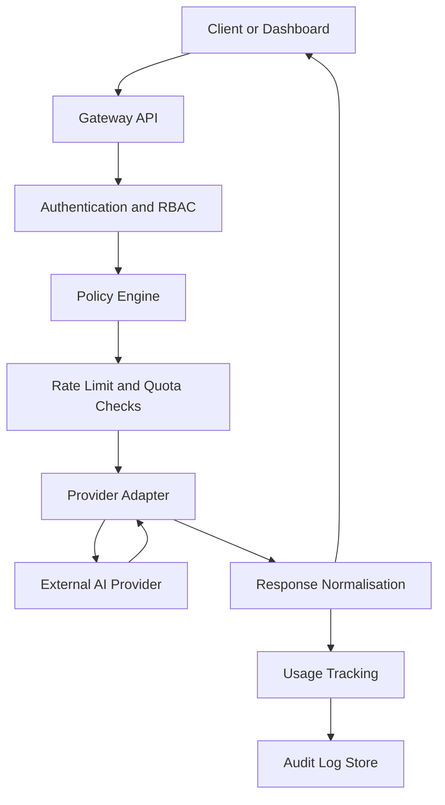

# Architecture Design

## Design Goals

Secure GPT Gateway is designed around a small set of practical goals:

- Centralise AI access through one controlled backend surface
- Avoid exposing provider credentials to clients
- Enforce authentication, authorization, and policy checks before model execution
- Track usage and audit events for governance and review
- Support provider abstraction so the system can evolve without rewriting every client
- Keep the design maintainable enough for incremental extension

## Gateway Architecture

The system uses a gateway pattern. Clients do not call AI providers directly. Instead, they call an internal backend API that performs identity checks, policy enforcement, rate limiting, quota validation, request routing, and usage recording before interacting with an external provider.

This creates a single control point for security, governance, and operational visibility.

## Main System Layers

### Frontend Dashboard

The frontend dashboard provides a user-facing entry point for demo interactions, usage summaries, and administrative views. It is intended to show how a controlled AI platform can surface both end-user functionality and governance-focused operational insight.

### Backend Gateway API

The backend gateway API is the central orchestration layer. It receives authenticated requests, coordinates validation steps, selects the provider adapter, records usage metadata, and returns controlled responses to the client.

### Authentication and Access-Control Layer

This layer verifies identity and enforces role-based access. It ensures only authenticated users can access protected routes and that administrative features remain restricted to appropriate roles.

### Policy Engine

The policy engine evaluates requests against defined organisational rules. Depending on the implementation and environment, policies may decide whether a request is allowed, blocked, transformed, or flagged for review.

### Rate Limit and Quota Layer

This layer protects the platform from abuse, excessive cost, and accidental overuse. It can enforce per-user, per-role, per-tenant, or environment-specific limits.

### Provider Adapter Layer

Provider adapters isolate vendor-specific integration logic behind a consistent internal interface. This reduces coupling between client-facing features and the details of any one AI provider.

### Audit Log and Usage Tracking Layer

This layer captures governance-relevant metadata such as request timestamps, actor identity, route usage, enforcement outcomes, and usage summaries. Prompt retention strategy can vary by policy and environment.

### Admin Configuration Layer

Administrative controls provide a managed place to review providers, policies, rate limits, quotas, and selected configuration state. In a public demo, these capabilities are intentionally restricted.

## High-Level Request Flow

## Why Clients Should Not Call AI Providers Directly

Direct provider access pushes control responsibilities outward to each consuming application. That usually produces inconsistent security practices, fragmented usage reporting, and weak cost controls.

By contrast, a gateway model allows the platform to:

- Keep provider keys inside backend infrastructure
- Apply uniform authentication and role checks
- Enforce policy consistently across clients
- Centralise rate limits and quotas
- Capture usage and audit metadata from one place
- Swap or add providers with less disruption

## Provider Abstraction and Future Expansion

Provider abstraction allows the system to expose a stable internal contract while hiding vendor-specific request and response differences. This is important for future expansion because it supports:

- Additional OpenAI-compatible providers
- Different model capabilities or routing strategies
- Fallback behaviour during provider outages
- Gradual migration away from a single vendor

## Maintainability and Governance Support

The design supports maintainability by separating concerns between identity, policy, provider access, and operational visibility. It supports governance by ensuring that decisions about who can use AI, under what limits, and with what review trail are enforced in the platform architecture rather than left to convention.
