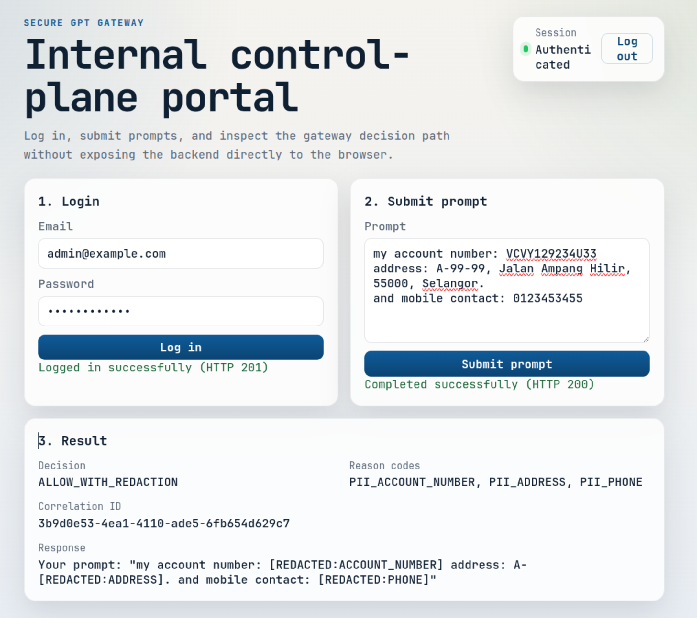

# Reviewer Walkthrough

## Who This Walkthrough Is For

This document is intended to help the following reviewers understand the showcase quickly:

- Recruiters
- Hiring managers
- Engineering leads
- Technical reviewers

## Suggested Review Path

1. Read [README](../README.md) for the project overview.
2. Inspect the demo screenshot in [README](../README.md) to see the reviewer-facing portal flow.
3. Read [Project Background](./01-project-background.md) to understand why the project exists.
4. Read [Architecture Design](./02-architecture-design.md) to understand the gateway pattern.
5. Read [Design Tradeoffs](./09-design-tradeoffs.md) to understand why the gateway, logging, source-code, and demo-boundary decisions were made.
6. Read [API Guide](./04-api-guide.md) to understand system boundaries.
7. Read [Governance and Maintenance](./05-governance-maintenance.md) to understand operational thinking.
8. Read [Demo Safety Boundaries](./07-demo-safety-boundaries.md) to understand why the public demo is restricted.
9. Review the live demo once available.

## What to Look For

When reviewing this showcase, the most useful signals are:

- Problem framing
- Architecture clarity
- Design tradeoff awareness
- Backend and API thinking
- Security and governance awareness
- Operational maintainability
- Documentation clarity
- Whether the demo makes the policy decision path understandable
- Whether redaction and reason codes are visible to reviewers
- Whether the UI communicates backend governance behaviour clearly
- Ability to communicate complex systems simply

## Demo Screenshot

This screenshot shows a controlled prompt submission where PII-like content is detected and the response is returned with redaction. It demonstrates the gateway's reviewer-facing decision visibility without exposing the backend directly to the browser.

## Demo Review Checklist

- Can I understand the purpose within 2 minutes?
- Is the gateway architecture clear?
- Are provider keys kept away from clients?
- Are policies, limits, and audit logs part of the design?
- Are public demo restrictions reasonable?
- Does the documentation show structured engineering thinking?

## How This Relates to My Engineering Experience

I have worked on production-critical backend systems where reliability, access control, auditability, and operational support matter.

This showcase reflects the same engineering habits: controlled access, clear system boundaries, traceable workflows, and maintainable design. It is not presented as company production work. It is a private-source showcase that demonstrates how I think about building and documenting systems that need both technical rigor and operational control.

## Current Demo Status

- Live demo URL: https://secure-gpt.davelhw.com
- Demo credentials: To be provided later
- Screenshots: Demo portal screenshot added; more may be added later
- Some admin features may be read-only, disabled, or simulated.
